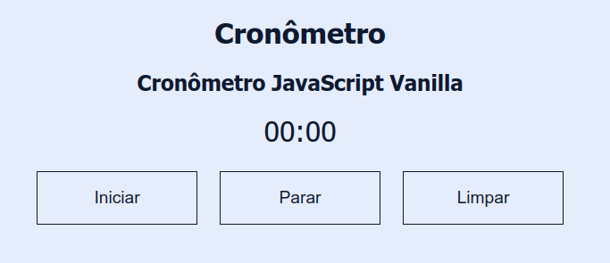

# Cronômetro (JavaScript)

## Um simples cronômetro em JavaScript Vanilla

Como parte do aprendizado em HTML, CSS e JavaScript, foi realizado o estudo do Cronômetro desenvolvido por Cathy Dutton (https://codepen.io/cathydutton/pen/xxpOOw)

